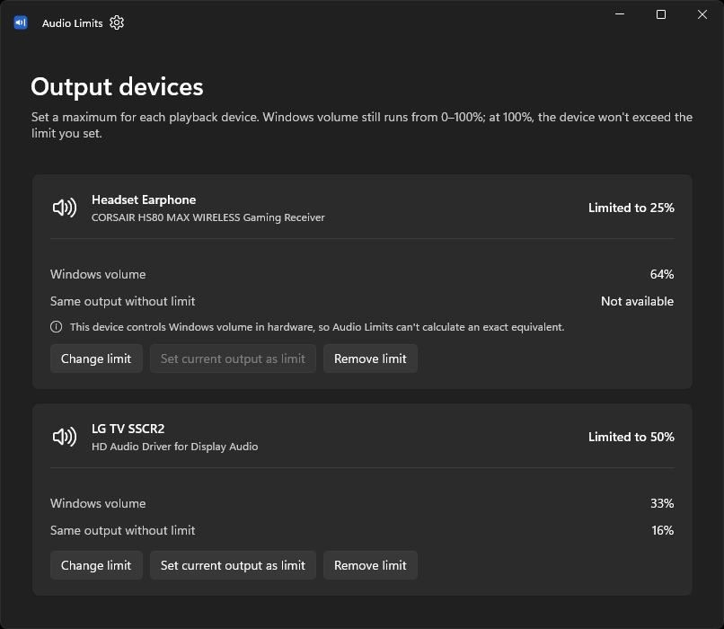

# Audio Limits [](https://github.com/MicaLovesKPOP/AudioLimits/releases/tag/v1.0.0-rc.2)

Audio Limits is a small Windows utility for setting a quieter maximum for each playback device while leaving the normal Windows volume slider at 0–100%.

It uses [Equalizer APO](https://sourceforge.net/projects/equalizerapo/) as the persistent attenuation backend. Once a limit is configured, Equalizer APO keeps applying it even when Audio Limits itself is not open.



> **Release status:** `1.0.0-rc.2` is a release candidate. The normal installed path and the extract-and-run path have been tested on real Windows hardware. The launcher's automatic prerequisite recovery on a genuinely clean PC is implemented but still awaiting a clean-VM validation.

## Download

GitHub releases contain exactly two binary choices:

### `AudioLimits-Setup.exe` — recommended

Normal Windows installation.

- choose **Just for me** or **Anyone who uses this computer**;
- supports update and repair when Setup is run again;
- creates the normal Start-menu / Installed Apps integration;
- downloads and installs only missing Microsoft runtime prerequisites;
- uninstalls through **Windows Settings → Apps → Installed apps**.

### `AudioLimits-1.0.0-rc.2-x64.zip` — no installation

For people who prefer extract-and-run software.

1. Extract the complete **Audio Limits** folder.
2. Run the root `AudioLimits.exe`.

The root of the extracted folder intentionally contains only the user-facing launcher; implementation/runtime files live under `app\`.

This ZIP is **not described as portable**. Audio Limits still stores settings in the normal per-user Windows location and can create a normal Start-with-Windows entry if you enable it. Copying the whole folder to another x64 Windows PC is supported; the launcher can offer to acquire missing Microsoft prerequisites before starting the internal WinUI app.

## Requirements

- Windows 10 version 2004 / build 19041 or newer; Windows 11 is the primary visual target.
- x64-compatible Windows.
- Equalizer APO for persistent audio attenuation.

Audio Limits uses the .NET 8 Desktop Runtime, the Microsoft Visual C++ x64 runtime, and Windows App Runtime 2.3.1. Users normally do **not** need to install these manually: Setup checks them, and the root launcher can also offer recovery when a copied/extracted folder is missing one.

Equalizer APO is different: device selection requires user interaction, so Audio Limits never installs/configures it silently. The app detects when Equalizer APO is missing or a playback device is not enabled and guides the user from there.

## What it does

- Configure a maximum output level independently for each playback endpoint.
- Keep the Windows volume slider usable across its full 0–100% range beneath that limit.
- Show the equivalent uncapped output when it can be calculated.
- Handle hardware-linked volume devices conservatively when exact equivalence is not available.
- Persist limits through Equalizer APO.
- Reconcile saved settings with the active audio configuration on startup.
- Run in the notification area, with optional Start with Windows behavior.
- Provide a modern WinUI 3 interface with light/dark/high-contrast support.

## Important limitation

Audio Limits is a convenience/safety aid, **not a hearing-protection guarantee**. Software or playback paths that bypass Equalizer APO can also bypass an Audio Limits cap. Hardware volume behavior varies by device.

## Application folder layout

Both Setup and the no-install ZIP use the same application layout:

```text
Audio Limits\
├─ AudioLimits.exe          # user-facing prerequisite launcher
└─ app\
   ├─ AudioLimits.App.exe   # internal WinUI application host
   └─ ...                   # app/runtime files
```

Shortcuts and Start-with-Windows integration always target the root `AudioLimits.exe` so the prerequisite check is retained if the folder is later moved or copied.

## Building from source

Requirements for development:

- Windows 10/11 x64;
- .NET 8 SDK;
- internet access for NuGet restore;
- Inno Setup 6+ for the installer. `build.ps1` can install it with WinGet when available.

Run:

```text
Build-PreRelease.cmd
```

The build:

1. closes any running Audio Limits processes;
2. restores the solution;
3. runs the preserved Core tests;
4. builds the WinUI app and bootstrap launcher;
5. creates the canonical `Audio Limits\AudioLimits.exe + app\` folder;
6. builds the normal Setup;
7. builds the no-install x64 ZIP.

The `release\` directory is intentionally clean and contains only the two user-facing release assets. Intermediate output and `RELEASE_REPORT.txt` go under `artifacts\`. `publish\` is a convenient unzipped copy of the canonical application folder for local testing.

## Repository structure

- `src/AudioLimits.Core` — limiter, persistence, Equalizer APO and audio-device logic.
- `src/AudioLimits.App` — WinUI 3 application.
- `src/AudioLimits.Launcher` — self-contained prerequisite launcher.
- `tests/AudioLimits.Core.Tests` — regression tests for the preserved Core behavior.
- `installer/AudioLimits.iss` — Inno Setup installer.
- `docs/` — design/verification history and release validation notes.

## Current release-candidate caveat

The real-machine tests have covered normal Setup/update/repair, runtime operation, tray behavior, relocation of the complete application folder, and the healthy prerequisite path. The remaining deferred release test is a clean Windows VM with one or more Microsoft prerequisites missing, to exercise the launcher's download/install/restart/error paths end-to-end.
